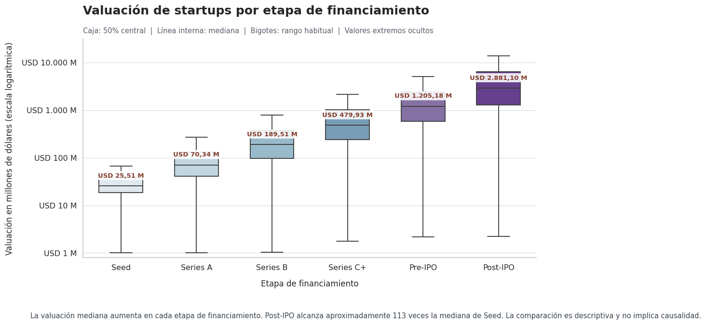
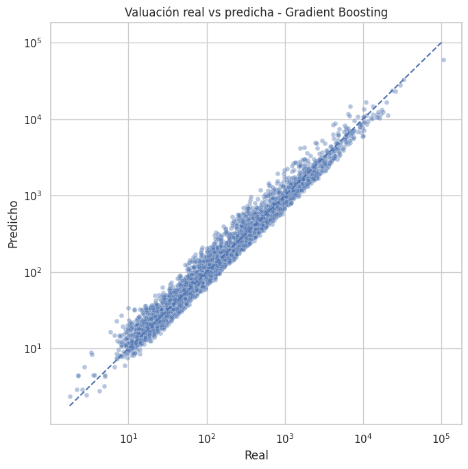

# 🚀 Valuación de Startups con Machine Learning

### ¿Qué hace valiosa a una startup tecnológica?

**Trabajo final de la Diplomatura en Ciencia de Datos de MundosE**

Analizamos qué factores financieros, tecnológicos y geográficos están asociados con la valuación de una startup y qué tan bien podemos estimarla mediante Machine Learning.

El proyecto combina análisis exploratorio, pruebas estadísticas y modelos predictivos para explorar una herramienta de apoyo para inversionistas: comprender patrones de valuación y reconocer dónde las predicciones requieren mayor cautela.

[📓 Explorar el notebook](Valuacion_Startups_Notebook_final.ipynb) · [📊 Ver presentación](Presentacion_Valuacion_Startups_Final.pptx.pdf) · [📁 Consultar dataset](global_tech_startups_2026.csv)

## 👩‍💻 Equipo

| Participante | Perfil profesional |
|---|---|
| Luciana Agüero | [LinkedIn](https://www.linkedin.com/in/luciana-ag%C3%BCero-0a19082a8/) |
| Priscila Gutierrez Sídoli | [LinkedIn](https://www.linkedin.com/in/priscilagsidoliiq/) |
| Vanesa Maldonado | [LinkedIn](https://www.linkedin.com/in/maldonadovanesa/) |
| Silvina Paredes | [LinkedIn](https://www.linkedin.com/in/silvina-cecilia-paredes-703aa33a/) |

## 🌎 Datos y alcance

**25.000 startups · 17 variables originales · 10 dominios tecnológicos · 10 países · 29 ciudades**

Cada registro representa una startup e incluye información sobre financiamiento, valuación, ingresos recurrentes anuales (ARR), burn rate, personal, ubicación y etapa de financiamiento.

La variable objetivo es `Valuation_USD_Millions`: **valuación de la empresa en millones de dólares**.

La muestra no está distribuida uniformemente: **59,8%** de las empresas está en Seed o Series A y **44,7%** se encuentra en Estados Unidos. Esta composición es relevante para interpretar los resultados.

Fuente: [Global Tech Startups — Kaggle](https://www.kaggle.com/datasets/saitejabandaruin/global-tech-startups-pipeline).

> **Alcance académico:** el dataset es sintético. El proyecto permite evaluar una metodología analítica, pero sus resultados no deben generalizarse directamente al mercado real.

## 🔎 Del análisis a la predicción

### 1. Comprender los datos y construir indicadores

Revisamos tipos de variables, faltantes y duplicados, y construimos indicadores de antigüedad, gasto anual y relaciones entre ingresos, gasto y financiamiento.

Exploramos las distribuciones financieras en escala original y logarítmica. La presencia de pocas empresas con valores muy elevados motivó el uso de medianas para comparar segmentos y de `log1p(valuación)` como objetivo del modelado.

### 2. Identificar patrones de valuación

Comparamos la valuación por dominio tecnológico, país y etapa de financiamiento. Complementamos los gráficos con **correlaciones de Spearman** y **pruebas de Kruskal–Wallis** para evaluar asociaciones y diferencias entre grupos.

- **Financiamiento y ARR** presentan asociaciones fuertes con la valuación: **ρ = 0,960** y **ρ = 0,943**.
- **Generative AI** registra la mayor mediana por dominio: **USD 144,88 M**.
- Las diferencias descriptivas entre dominios son más marcadas que entre países.
- La etapa de financiamiento muestra una progresión clara en las medianas.

**Qué aporta este gráfico:** muestra tanto el aumento de la valuación como la dispersión dentro de cada etapa. La mediana Post-IPO es aproximadamente **113 veces** la de Seed, pero empresas de una misma etapa pueden tener valuaciones muy diferentes. La etapa aporta contexto; no determina por sí sola el valor de una empresa.

### 3. Comparar modelos y examinar sus errores

Entrenamos **regresión lineal, Random Forest y Gradient Boosting** con una partición de **80% entrenamiento y 20% prueba**. Utilizamos pipelines con imputación, estandarización y codificación de variables categóricas.

Evaluamos R² sobre el objetivo logarítmico y, después de volver a la escala original, calculamos R², MAE y RMSE en millones de USD.

| Modelo | R² log | R² original | MAE · USD M | RMSE · USD M |
|---|---:|---:|---:|---:|
| Gradient Boosting | **0,9730** | 0,8742 | **111,27** | 768,10 |
| Random Forest | 0,9716 | **0,8993** | 112,16 | **687,12** |

*Se muestran los dos modelos con mejor desempeño. La comparación completa incluye regresión lineal y está disponible en el notebook.*

**La elección depende del objetivo:** Gradient Boosting lidera en R² log y MAE; Random Forest obtiene mejores resultados en R² original y RMSE, que dan mayor peso a los errores monetarios grandes.

**Qué aporta este gráfico:** permite observar dónde las predicciones acompañan los valores reales y dónde se alejan de la diagonal ideal. Los ejes logarítmicos facilitan la comparación entre tamaños, pero deben leerse junto con los errores en dólares:

- **USD 12,01 M:** error absoluto mediano.
- **USD 197,43 M:** percentil 90 del error absoluto.
- **USD 1.234,97 M:** MAE entre startups valuadas por encima de USD 2.000 M.

La validación cruzada de cinco particiones obtuvo un **R² log promedio de 0,9735**, con un **desvío estándar de 0,0005**. Esto muestra estabilidad interna, aunque no reemplaza una evaluación con datos externos.

### 4. Explorar perfiles mediante clustering

Aplicamos **K-Means** sobre financiamiento, valuación, ARR, burn rate y antigüedad, utilizando transformación logarítmica en las variables monetarias y estandarización.

Entre las alternativas de **2 a 6 clusters**, la mejor puntuación Silhouette fue **0,483**, con **dos grupos**:

- **Menor escala financiera:** 69,3% de la muestra; valuación mediana de **USD 39,53 M**.
- **Mayor escala financiera:** 30,7%; valuación mediana de **USD 558,20 M**.

Esta segmentación complementa la predicción con una descripción de perfiles. Como la valuación forma parte del clustering, los grupos no constituyen una validación independiente del modelo predictivo.

## 💡 Conclusión

En esta muestra, la valuación está fuertemente asociada con el financiamiento, los ingresos y la etapa de desarrollo. Los modelos basados en árboles capturan bien estos patrones, pero las empresas de valuación extrema siguen concentrando errores monetarios importantes.

El principal aporte del proyecto es **conectar exploración, evidencia estadística y evaluación predictiva**, mostrando tanto el potencial como los límites de la estimación. Las asociaciones no implican causalidad y una aplicación real requeriría datos externos y una evaluación financiera más amplia.

---

**Tecnologías:** Python · pandas · NumPy · Matplotlib · Seaborn · SciPy · scikit-learn · Google Colab
